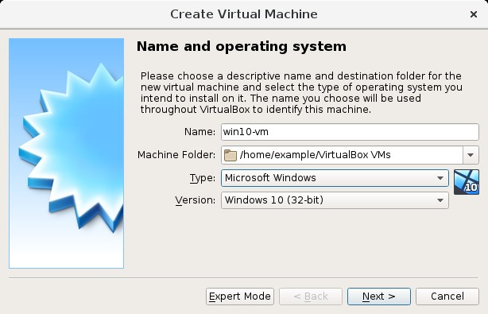
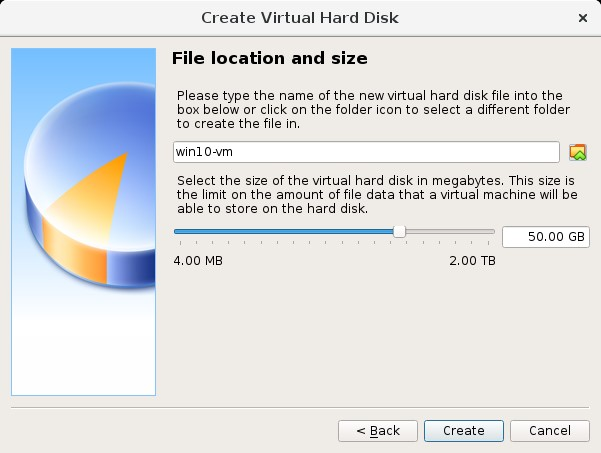
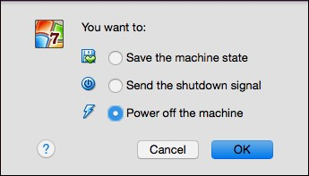
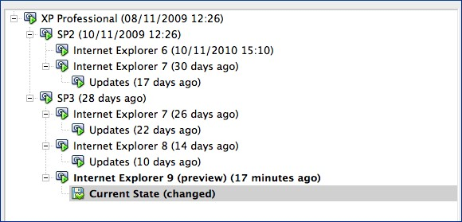
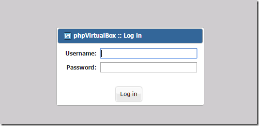
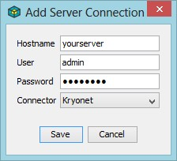
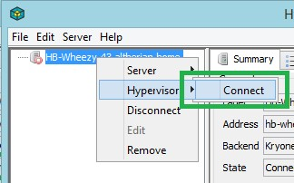
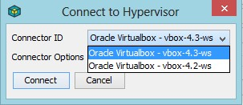
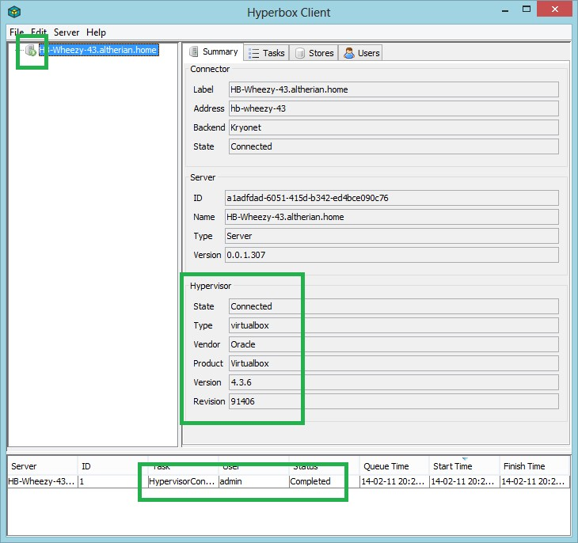
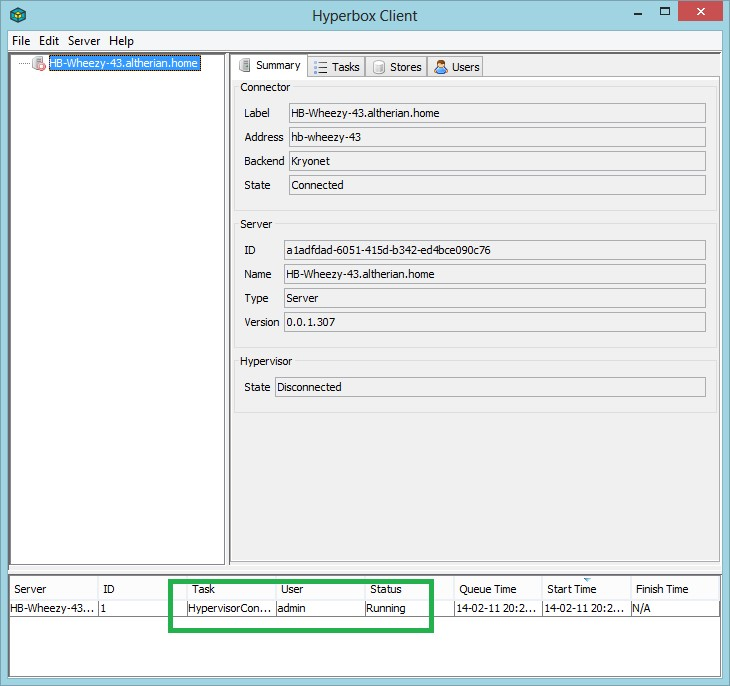

云平台虚拟化管理软件包括VirtualBox、PHPVirtualBox、Hyperbox三个开源软件，其中virtualbox提供虚拟机的管理功能，而PHPVirtualBox与Hyperbox可以实现对virtualbox的远程访问，从而实现远程管理虚拟机的功能。

# VirtualBox

## 简介

Oracle VM VirtualBox是一个跨平台的虚拟化应用程序。它可以安装在基于Intel或AMD的计算机上，无论这些计算机运行的操作系统是Windows，Mac OS X，Linux还是Oracle Solaris。它扩展了现有计算机的功能，使计算机可以同时在多个虚拟机中运行多个操作系统。例如，您可以在Mac上运行Windows和Linux，在Linux服务器上运行Windows Server 2016，在Windows PC上运行Linux，等等。您可以根据需要安装和运行任意数量的虚拟机，唯一的限制只是磁盘空间和内存大小。Oracle VM VirtualBox功能强大，它可以在小型嵌入式系统，桌面类机器，数据中心甚至云环境中运行。

## 基本功能与操作

### 创建虚拟机

单击VirtualBox Manager窗口中的New。将显示一个向导，指导您完成设置新虚拟机（VM）的操作。

在向导页面中，将需要你填入以下信息：

Name：即VM 的名称，稍后将显示在VirtualBox Manager窗口的计算机列表中，并作为磁盘上的VM文件的名称。

本机文件夹：即虚拟机存储在计算机上的位置。

操作系统类型：即稍后要安装的操作系统。支持的操作系统已分组。如果要安装未列出的操作系统类型，请选择“ 其他”。

接下来，您必须为VM 指定虚拟硬盘。

该向导显示以下窗口：

要创建新的空虚拟硬盘，请单击“创建”按钮。您也可以选择现有的磁盘映像文件。

如果您是第一次使用Oracle VM VirtualBox，则需要创建新的磁盘映像。单击“创建”按钮。这将显示另一个窗口，即“ 创建虚拟硬盘向导”向导。此向导可帮助您在新虚拟机的文件夹中创建新的磁盘映像文件。

选择或创建文件后，单击“ 下一步”转到下一页。

单击“ 创建 ”以创建新虚拟机。虚拟机显示在VirtualBox Manager窗口左侧的列表中，其名称为您最初输入的名称。

### 运行虚拟机

要启动虚拟机，您有以下几种选择：

* 在VirtualBox Manager窗口的列表中双击VM。
* 在VirtualBox Manager窗口的列表中选择VM，然后单击窗口顶部的Start。
* 转到VirtualBox VMs 系统用户主目录中的文件夹。找到要启动的计算机的子目录，然后双击计算机设置文件。此文件具有 .vbox文件扩展名。

启动虚拟机会显示一个新窗口，您选择的虚拟机将启动。通常在虚拟系统的监视器上看到的所有内容都显示在窗口中。

这时，您可以像使用真实计算机一样使用虚拟机。

### 保存虚拟机状态

当您单击 窗口右上角的虚拟机窗口的“ 关闭”按钮时，就像关闭系统上的任何其他窗口一样，Oracle VM VirtualBox会询问您是要保存还是关闭VM。作为快捷方式，您也可以按主机键+ Q。

三个选项分别意味着：

保存机器状态： 使用此选项，Oracle VM VirtualBox 将其状态完全保存到本地磁盘，冻结虚拟机。当您再次启动VM时，VM停留在上次保存虚拟机时的状态。

发送关机信号：这将向虚拟机发送ACPI关闭信号，这与您按下真实计算机上的电源按钮具有相同的效果。

关闭计算机电源：使用此选项，Oracle VM VirtualBox也会停止运行虚拟机，但不保存其状态。

### 虚拟机快照功能

使用快照，可以保存虚拟机的特定状态以供以后使用。在以后的某个时间，您可以恢复到该状态，即使从那时起您可能已经大大改变了VM。因此，虚拟机的快照类似于处于“已保存”状态的计算机，但可以存在许多虚拟机，并保留这些已保存的状态。

要查看虚拟机的快照，请单击VirtualBox Manager中的计算机名称。然后单击计算机名称旁边的“ 列表”图标，然后选择“ 快照”。在拍摄机器快照之前，快照列表将为空，但“ 当前状态”项除外，该项表示虚拟机生命周期中的“现在”状态。

快照有三个相关的操作：拍摄、恢复和删除

#### 拍摄快照

这会生成机器当前状态的副本，您可以在以后的任何给定时间返回该状态。

* 如果您的VM正在运行，请从VM窗口的 Machine下拉菜单中选择Take Snapshot。

* 如果您的VM处于“已保存”或“已关闭”状态（如Oracle VM VirtualBox主窗口中的VM名称旁边所示），请单击计算机名称旁边的“ 列表”图标，然后 选择“快照”。将显示快照窗口。执行以下操作之一：单击“获取” 图标；右键单击列表中的Current State项，然后选择 Take。

虚拟机的快照列表如下图如所示：

#### 恢复快照

在快照列表中，右键单击已执行的任何快照，然后选择 “还原”。通过恢复快照，您可以及时返回或前进。机器的当前状态丢失，机器恢复到拍摄快照时的状态。

#### 删除快照

这不会影响虚拟机的状态，但只会释放Oracle VM VirtualBox用于存储快照数据的磁盘上的文件，从而释放磁盘空间。要删除快照，请右键单击快照树中的快照名称，然后选择“删除”。即使计算机正在运行，也可以删除快照。

### 虚拟机配置

从VirtualBox Manager窗口的列表中选择虚拟机时，您将在右侧看到该计算机设置的摘要。

单击“ 设置”将显示一个窗口，您可以在其中配置所选VM的许多属性。但是在更改VM设置时要小心。安装客户虚拟机操作系统后，可以更改所有VM设置，但某些更改可能会阻止客户虚拟机操作系统在安装后完成后正常运行。

### 删除虚拟机

您可以从Oracle VM VirtualBox中删除VM。

要删除VM，请在VirtualBox Manager的计算机列表中右键单击VM，然后选择“删除”。

通过确认对话框，您可以指定是仅从计算机列表中删除VM还是删除与VM关联的文件。

请注意，VM正在运行时禁用“ 删除”菜单项。

### 移动虚拟机

要将VM移动到主机上的新位置，请在VirtualBox Manager的计算机列表中右键单击VM，然后选择“ 移动”。文件对话框会提示您指定VM的新位置。

移动VM时，Oracle VM VirtualBox配置文件会自动更新以使用主机上的新位置。

请注意，VM正在运行时禁用“ 移动”菜单项。

您还可以使用VBoxManage movevm 命令移动VM。

### 克隆虚拟机

您可以创建现有VM的完整副本或链接副本。此副本称为克隆。您可以使用克隆的VM来试验VM配置，测试不同的客户虚拟机操作系统级别或备份VM。

“ 克隆虚拟机”向导将指导您完成克隆过程。

通过单击VirtualBox Manager的计算机列表的右键单击菜单或所选VM 的 Snapshots视图中的Clone来启动向导 。

为克隆指定新名称。您可以为克隆的虚拟机选择路径，否则Oracle VM VirtualBox将使用默认的计算机文件夹。

“ 克隆类型”选项指定是创建链接到源VM的克隆还是创建完全独立的克隆：

* 完全克隆：将所有相关磁盘映像复制到新VM文件夹。完整克隆可以在没有源VM的情况下完全运行。
* 链接克隆： 根据源VM磁盘映像创建新的差异磁盘映像。如果选择源VM的当前状态作为克隆点，Oracle VM VirtualBox将创建新快照。

“ 快照”选项指定是仅创建当前计算机状态的克隆还是创建所有内容的克隆。

* 一切：克隆当前机器状态及其所有快照。
* 当前机器状态和所有子快照：克隆VM快照及其所有子快照。

以下克隆选项可用：

* MAC地址策略：指定克隆VM时如何保留网卡MAC地址。
* 保留磁盘名称：克隆VM时保留磁盘映像名称。
* 保留硬件UUID：克隆VM时保留硬件通用唯一标识符（UUID）。

克隆操作的持续时间取决于连接的磁盘映像的大小和数量。此外，克隆操作会保存快照的所有差异磁盘映像。

请注意，在计算机运行时禁用“ 克隆”菜单项。

### 全局设置

通过单击“ 首选项”项，可以使用“文件”菜单显示 “全局设置”对话框。此对话框提供一系列设置，其中大部分适用于当前用户的所有虚拟机。“扩展”选项适用于整个系统。

可以使用以下设置：

* 一般。允许用户指定VM文件的默认文件夹/目录和VRDP身份验证库。

* 输入。允许用户指定主机密钥。它标识切换光标是否位于VM焦点或主机操作系统窗口中的键。

* 更新。允许用户为自动更新指定各种设置。

* 语言。允许用户指定GUI语言。

* 显示。允许用户指定屏幕分辨率及其宽度和高度。可以为所有访客屏幕指定默认比例因子。

* 网络。允许用户配置“仅主机网络”的详细信息。

* 扩展。允许用户列出和管理已安装的扩展包。

* 代理。允许用户配置HTTP代理服务器。

# PHPVirtualBox

## 简介

PHPVirtualBox是一个开源的VirtualBox网页接口，一个基于php构建的VirtualBox前端界面，可以通过浏览器来实现对VirtualBox主机进行管理，web界面使用了AJAX 技术，在浏览器里对VirtualBox进行远程管理时，看上去和本地的VirtualBox控制台差不多。PHPVirtualBox的特点：

* 开启/关闭虚拟机

* 快照 查看虚拟机

* 配置虚拟机 媒体管理
	
* 创建虚拟机向导 全局网络配置
	
* 导入/导出虚拟机 访问虚拟机控制台
	
* 多语言支持

### 使用PHPVirtualbox

要实现对虚拟机的远程管理，需在安装了virtualbox的主机或服务器上安装PHPVirtualbox，远程终端在浏览器输入：

>http://IP_address/phpvirtualbox/

其中IP_address为安装了PHPVirtualbox的主机或服务器的IP地址。

接着需要登录用户名及密码

默认登录用户名：admin

默认登录密码：admin

然后就可以远程控制虚拟机，其操作界面与操作方式与virtualbox一样。

# Hyperbox

## 简介

hyperbox可以为VirtualBox提供具有高级功能的管理网关，并且可以通过模块向任何管理程序和扩展开放，从而轻松实现对virtualbox管理控制台的远程访问。

Hyperbox由三个主要组件组成：

客户端：处理用户输入，将其发送到客户端并显示结果或数据更改。

服务器：管理虚拟机管理程序，抽象出它的细节，并提出一个共同的管理层到客户端和证明了一系列的功能，这通常不会存在于虚拟机管理程序本身。

Hypervisor：运行实际的虚拟化实体，即实际的虚拟机管理程序。

## 基本操作

使用hyperbox实现对虚拟机的远程操作，需要在hyperbox客户端中添加服务器并连接虚拟机管理程序，成功连接后即可实现对虚拟机的远程管理。

### 添加服务器

在菜单栏中，单击服务器>添加...

系统将提示您输入要连接的服务器的主机名/ IP地址。默认情况下，Hyperbox Server默认侦听器在所有接口上都可用。

默认用户名/密码为：admin / hyperbox 

完成后单击“保存”。

### 连接hypervisor

您现在可以右键单击>连接或双击服务器地址以启动连接。

如果成功，图标将更改为停止的服务器图标，并且右侧面板上的选项卡应激活。您还应该看到Hyperbox Server的详细信息，并且它与虚拟机管理程序断开连接。

右键单击服务器：选择Hypervisor> Connect

Hyperbox默认带有几个连接器。选择与您的安装相匹配的一个。您现在可以将“连接器选项”字段留空，它用于高级配置。单击“连接”。

您现在应该在底部列表中看到一个新任务，显示Hyperbox当前正在连接并初始化与管理程序的连接。

如果成功，服务器图标将更改以及详细信息面板中的管理程序状态。

您现在可以通过右键单击左侧面板中的服务器列表项来管理您的计算机或创建新计算机。

