桌面软件部分期望终端系统通过XRDP协议连接并操作云平台的虚拟桌面。为此，在Linux系统的云平台上，需要配置XRDP协议服务端并安装常用软件，包括办公软件WPS，视频媒体播放器VLC，以及Windows平台的QQ和Photoshop软件；在树莓派终端平台上，安装XRDP协议客户端软件。

# Ubuntu

以下内容在Ubuntu 19.04下进行过测试。

## Xrdp Server

图形界面下的Linux远程登陆协议，一般会使用VNC，但鉴于VNC的安全性和性能均低于RDP协议，且RDP协议在Windows中使用更为方便，所以选择Xrdp。

```shell
sudo apt install -y xrdp
## 使用非gnome桌面按需修改下面一行
echo "gnome-sesssion" > ~/.xssesion
sudo /etc/init.d/xrdp restart
```

Windows用户可以直接打开`远程桌面`，输入IP地址即可访问远程桌面。

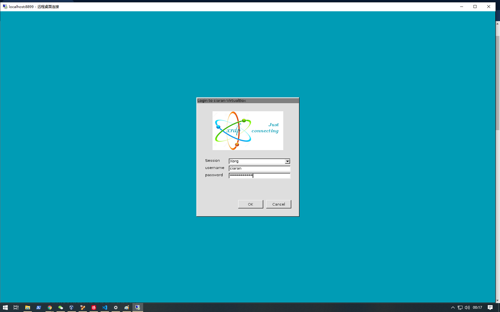

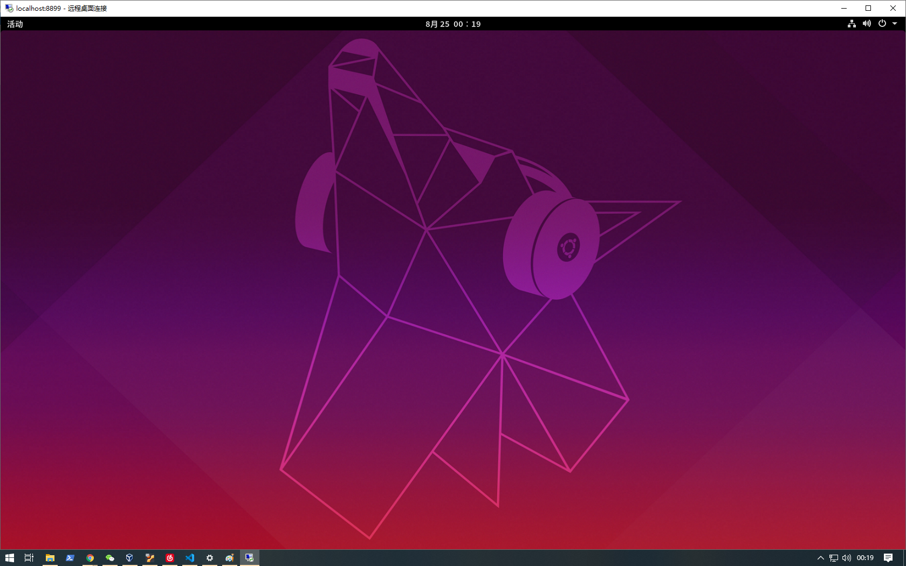

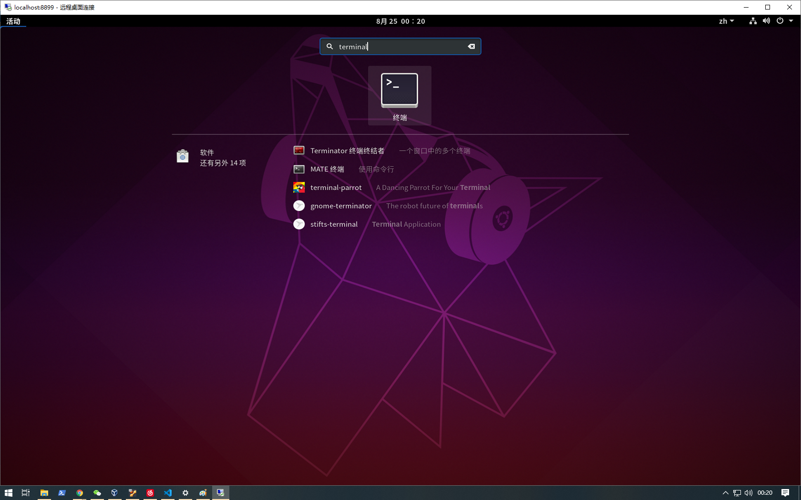

Linux用户可以通过安装`Remmina`访问远程桌面。详细参见下文。

注意，由于使用`gnome-session`，远程登陆与直接使用会共用一个gnome会话，若同时登陆使用可能会出现有一方无法打开窗口的情况，因此建议不应同时登陆单用户。

### WPS 

Ubuntu系统本身自带LibreOffice，然而对于在Windows下一直使用WPS的用户来讲，在Ubuntu系统上安装WPS尊重了Linux用户特定的使用习惯，且WPS For Linux版也延续了Windows版相同的体验，深度兼容，在线模版和素材使得文档创作更加轻松高效。安装方法是去WPS For Linux的官方网站`http://linux.wps.cn/` 下载WPS的deb安装包，

```shell
## 从`https://linux.wps.cn`下载deb文件
wget https://wdl1.cache.wps.cn/wps/download/ep/Linux2019/8722/wps-office_11.1.0.8722_amd64.deb
## 安装deb文件
sudo apt install -y ./wps-office_11.1.0.8722_amd64.deb
```

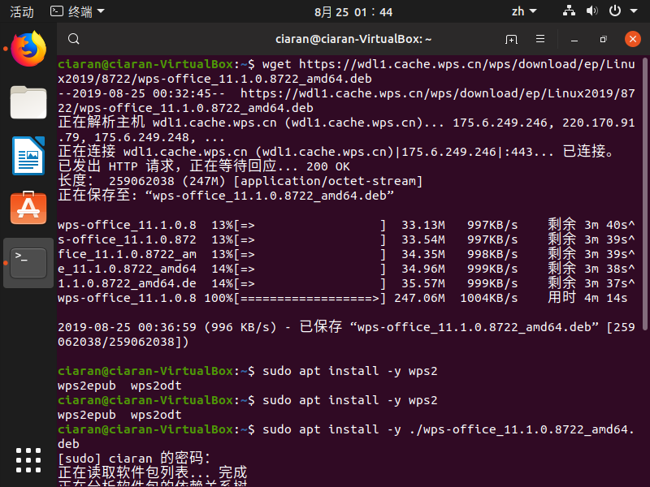

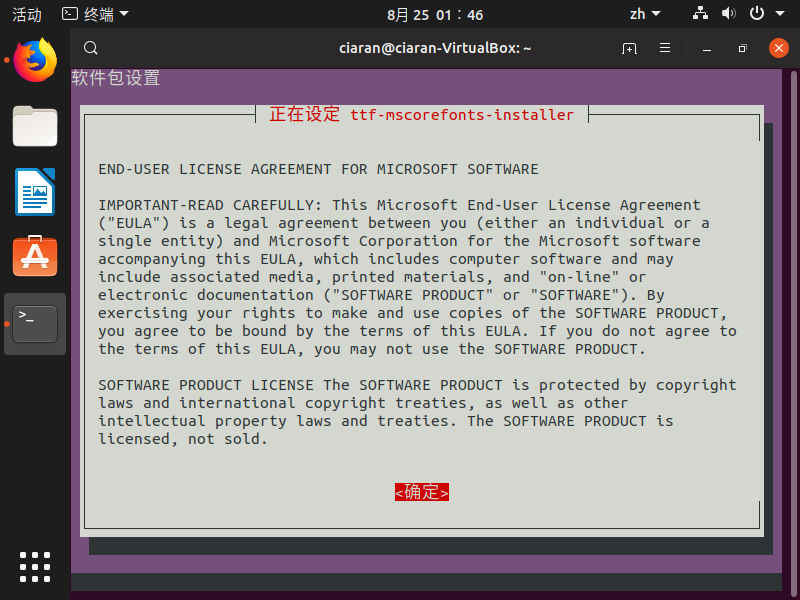

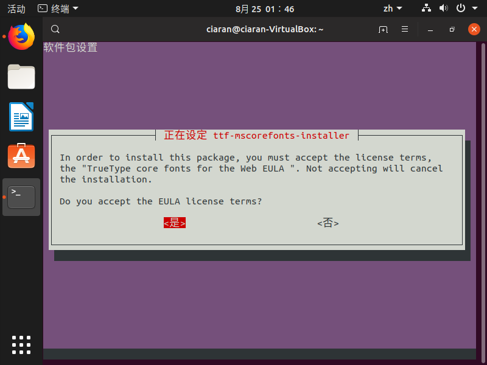


安装完成后可以直接在命终端输入`wps`打开，或可以使用`/etc/share/applications/wps-office-wps.desktop`打开，桌面亦会出现wps桌面的图标。

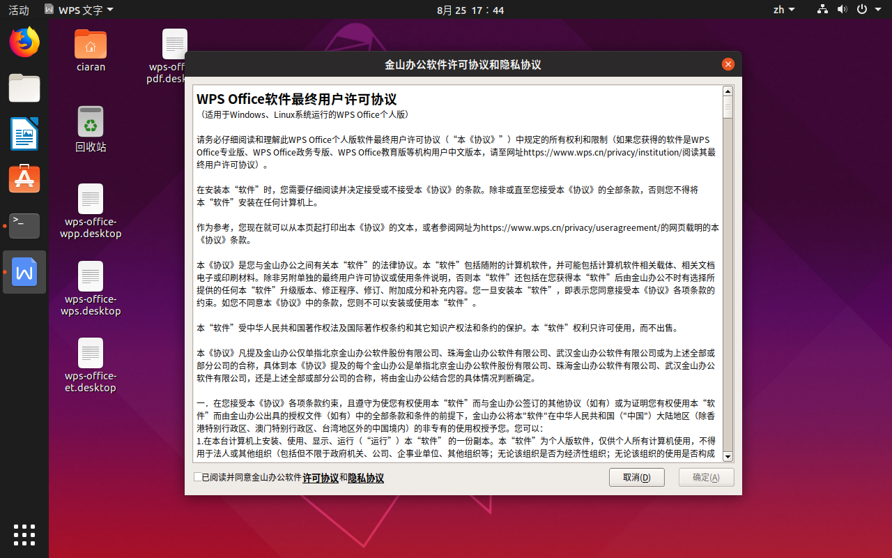

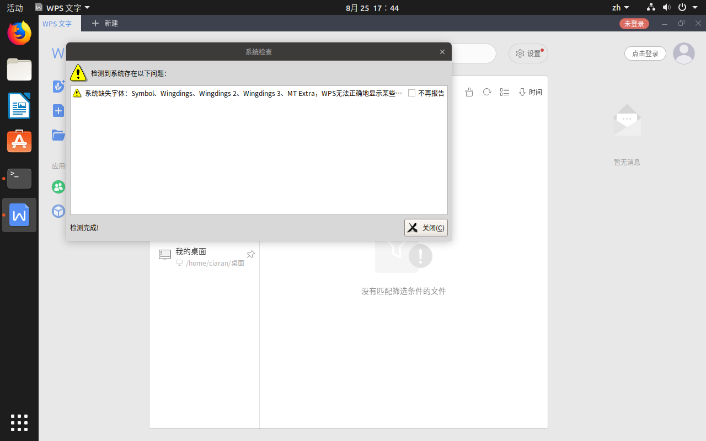

在初次启动后提示字体缺失可以通过以下步骤解决：

1. 下载缺失的字体(后缀为ttf)文件
2. 将字体文件复制到`/usr/share/fonts/`
3. 执行以下操作:

    ```shell
    sudo mkfontscale
    sudo mkfontdir
    sudo fc-cache
    ```

### VLC

VLC是一款开源的多媒体播放器，适用于像Linux、Microsoft Windows、Mac OS X和Android这样的操作系统，它支持多种音视频格式，能播放来自各种网络资源的MPEG、MPEG2、MPEG4、DivX、MOV、WMV、QuickTime、mp3、Ogg/Vorbis文件、DVD、VCD以及多种格式的流媒体等。它还可以用作流媒体服务器，将它所接收的流媒体进行复制，并将它们通过网络传播给其他客户端，或者通过HTTP协议提供服务。

```shell
sudo apt install -y vlc
```

安装完成后可以直接在终端输入`vlc`打开，或可以使用`/etc/share/applications/vlc.desktop`打开。

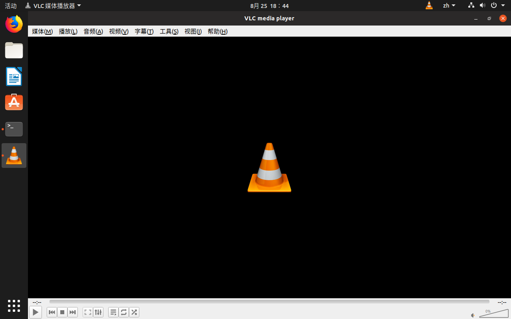

## Wine QQ

开源软件Wine的作用是让Windows应用程序可以在Linux操作系统环境下加载和运行。它为Windows应用程序提供了Win32 API兼容的接口，提供了经过仿真实现的以动态链接库（DLL）为主的Windows操作系统运行环境，包括对象管理、进程和线程管理以及套接字等等。当Windows程序请求Win32 API服务时，Wine把该请求转换成了对Linux操作系统的相关系统调用，然后再将服务返回给应用进程。因此，Windows应用程序就能在Linux操作系统上运行了。在Wine中运行的Windows程序，就如同运行原生Linux程序一样，不会有模拟器那样的性能问题。

Deepin-Wine针对QQ等国内应用做了深度优化，QQ和微信等在Deepin-Wine环境下可以基本没有Bug地运行，因此首先安装Deepin-wine环境的Ubuntu移植版。

```shell
## 从 `https://github.com/wszqkzqk/deepin-wine-ubuntu` 安装Deepin-wine地Ubuntu移植版
sudo apt install -y git
git clone https://gitee.com/wszqkzqk/deepin-wine-for-ubuntu.git --depth 1
cd deepin-wine-for-ubuntu/ && sudo ./install.sh
## 从 `http://mirrors.aliyun.com/deepin/pool/non-free/d/deepin.com.qq.im/` 下载deb文件
wget http://mirrors.aliyun.com/deepin/pool/non-free/d/deepin.com.qq.im/deepin.com.qq.im_8.9.19983deepin23_i386.deb
sudo apt install -y ./deepin.com.qq.im_8.9.19983deepin23_i386.deb
```

安装完成后可以从左上角`activities`搜索并打开QQ，或使用`/etc/share/applications/deepin.com.qq.im.desktop`打开QQ(可创建桌面快捷方式)。

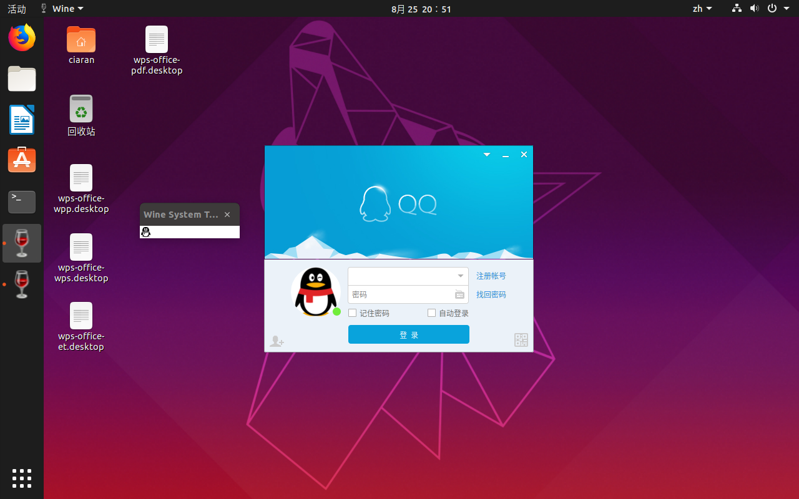

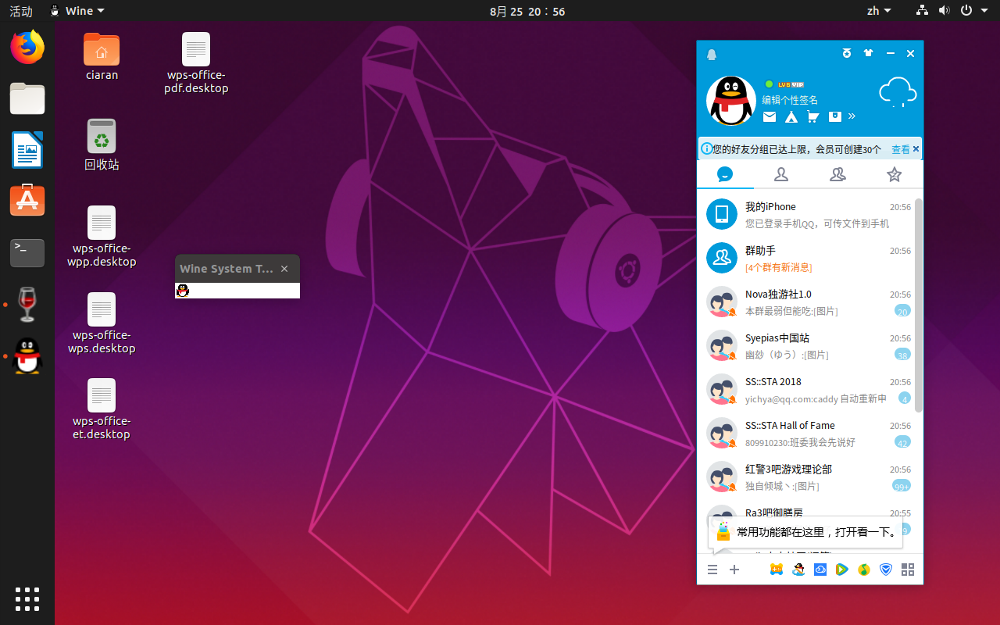

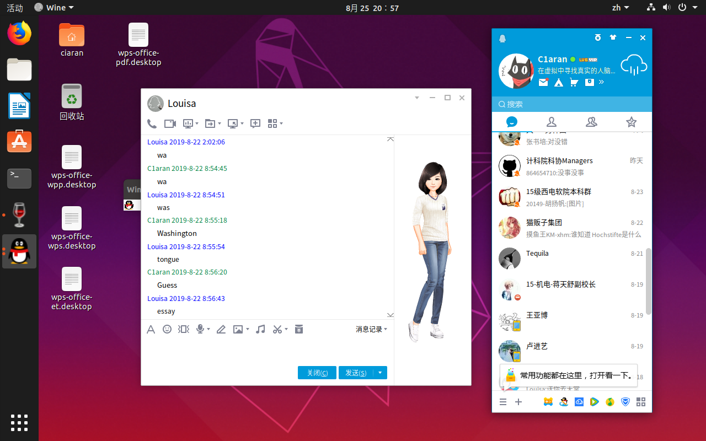

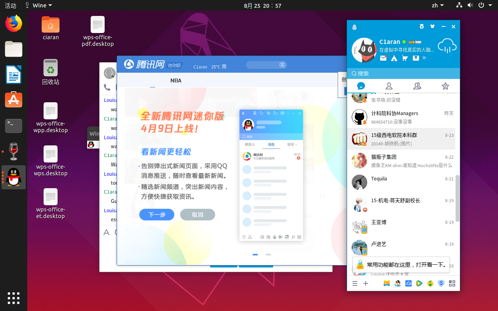

## Wine PhotoShop

Adobe Photoshop，简称“PS”，是一个由Adobe开发和发行的图像处理软件。Photoshop主要处理以像素所构成的数字图像。使用其众多的编修与绘图工具，可以更有效的进行图片编辑工作。独特的历史纪录浮动视窗和可编辑的图层效果功能使用户可以方便的测试效果。对各种滤镜的支持更令使用户能够轻松创造出各种奇幻的效果。

PlayOnLinux是一款旨在让您轻松安装和使用Windows一起运行的众多游戏和应用程序软件。PlayOnLinux为迁移到Linux这题带来了一个免费，可访问且高效的解决方案。


```shell
## 安装Playonlinux
sudo apt install -y playonlinux
playonlinux
```

在列出的软件中选择 `Adobe Photoshop CS2` 进行安装。

安装完成后在`playonlinux`中打开。

# Raspberry

树莓派3B Raspbian系统下进行测试。

## Remmina

为了实现对远程主机的控制，需要安装RDP客户端软件，在此我们推荐使用Remmina。Remmina是一个集成了RDP、VNC等远程连接协议的远程客户端。其界面简单友好，操作方便，便于新手上手。

```shell
sudo apt install -y remmina
```

安装后在终端输入`remmina`即可打开软件。
