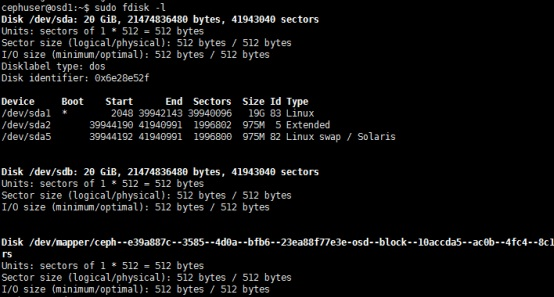
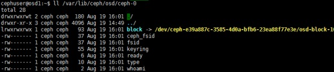
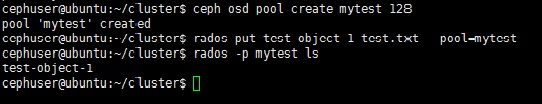
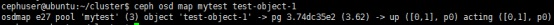
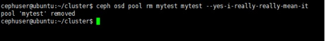
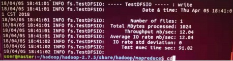
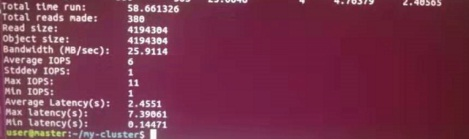

本软件属于我校国际校区未来网络创新平台的管理平台，软件主体为CEPH分布式存储平台，在有性能需求时，可以将其与SPDK，DPDK,SSD缓存等技术相融合，旨在实现一个高性能的分布式存储系统，并实现下述目标：为虚拟机和实体机提供网络分布式存储；控制分布式存储中多个虚拟数据节点的负载均衡、冗余备份；提供iSCSI接口的远程虚拟存储空间。

本软件的规格指标包括：支持IPv6；远程可视化管理；支持500虚拟机；支持2TB内存分配；支持800TB存储分配；没有CPU数量上的使用许可证限制。

现对本软件相关的平台与技术做一个简要说明。

# 一.CEPH简介与运行

## 1. CEPH的简介


CEPH是一个开源的分布式存储系统，可以提供提供高性能，的可靠性和可扩展性,其主要支持三种存储方式：读写效率高的块存储，可以实现共享的文件存储和针对内置大容量硬盘的分布式服务器的对象存储。

在CEPH的文件读写中，涉及到Object,PG,OSD等概念，以及其自带的CRUSH算法。Object对象是CEPH最底层的存储单元，每个Object包含元数据和原始数据。PG全称Placement Grouops，是一个逻辑的概念，一个PG包含多个OSD。PG这一概念是用于更好地分配并定位数据，一个PG里面会有很多Object。而OSD全称Object Storage Device，是负责响应客户端请求返回具体数据的进程。一个CEPH集群一般都有很多个OSD。CRUSH是CEPH使用的数据分布算法，类似一致性哈希，让数据分配到预期的地方。

## 2.CEPH的部署与简单使用


登录CEPH官网https://ceph.com/,按照官方的指引，可完成平台相关组件的获取与CEPH的快速下载。

此外，部署CEPH的具体步骤，可以参见下述三个链接，在多个虚拟机上完成(linux ubuntu系统)。

- https://linux.cn/article-8182-1.html

- https://blog.csdn.net/shuningzhang/article/details/90105731

- https://blog.csdn.net/alexdu74828/article/details/53712536

部署一个CEPH集群的大致步骤为：

1. 创建CEPH用户并配置各个节点IP；

2. 安装和配置NTP；

3. 配置SSH免密登录；

4. 配置Ubuntu防火墙；

5. 配置OSD节点，进行磁盘分区；

6. 创建CEPH集群并测试


若正确完成CEPH的部署，输入`sudo ceph -s`可检查集群状态：

 


此外，可以登录osd1节点查看磁盘状态：




使用` ll /var/lib/ceph/osd/ceph-0`查看磁盘挂载情况：

 

下面进行CEPH文件存储与删除的简单测试。

创建存储池：

```
ceph osd pool create mytest 128
```

将包含对象数据的测试文件添加到存储池：

```
rados put test-object-1 test.txt --pool=mytest
```

验证CEPH集群是否存储了该对象：

```
rados -p mytest ls
```



找出对象的存储位置：

```
ceph osd map mytest test-object-1
```



删除对象：

```
rados rm test-object-1 --pool=mytest
```

删除存储池：

```
ceph osd pool rm mytest mytest –yes-i-really-really-mean-it
```



## 3.CEPH的性能测试


之前实验室已进行过ceph的读写性能检测，对小规模系统的Hadoop和CEPH分别进行测试后，发现CEPH的性能更优。



 


# 二.SPDK简介


SPDK的全称为Storage Performance Development Kit, 其利用UIO和pooling两大技术，使得SPDK是完全存在于用户态的，无论是驱动还是框架都采用轮询代替了中断，并且数据的搬迁都是“零拷贝”的。基于这些特点，SPDK的性能较内核态相比，有了很大的提高。


# 三.DPDK简介


DPDK（Data Plane Development Kit），旨在提供对网络数据包的高性能处理。DPDK支持类似NAPI的机制，用户可以配置何时关闭中断，何时轮询结束等等。


# 四.参考资料

关于CEPH:

- https://cloud.tencent.com/developer/news/275070
- https://linux.cn/article-8182-1.html
- https://k2r2bai.com/2016/12/03/ceph/ceph-spdk/
- https://ceph.com/code/
- http://blog.csdn.net/wangtaoking1/article/details/46639645
- https://www.cnblogs.com/me115/p/6366374.html
- http://ceph.org.cn/

关于SPDK: https://blog.csdn.net/zlarm/article/details/79140299

关于DPDK: https://www.cnblogs.com/qcloud1001/p/9585724.html